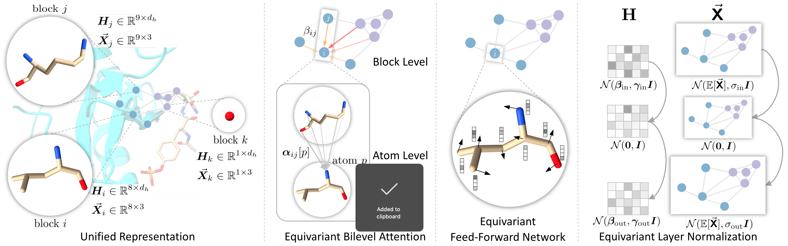

# GET: Generalist Equivariant Transformer Towards 3D Molecular Interaction Learning



This repo contains the codes for our paper [Generalist Equivariant Transformer Towards 3D Molecular Interaction Learning (ICML 2024)](https://arxiv.org/abs/2306.01474).

## Quick Links
- [Cleaned Codes of GET](#cleaned-codes-of-get)
- [Setup](#setup)
    - [Environment](#environment)
    - [Datasets](#datasets)
- [Experiments](#experiments)
    - [PDBbind Benchmark](#pdbbind-benchmark)
    - [Protein-Protein Affinity (PPA)](#protein-protein-affinity-ppa)
    - [Ligand Binding Affinity (LBA)](#ligand-binding-affinity-lba)
    - [Ligand Efficacy Prediction (LEP)](#ligand-efficacy-prediction-lep)
    - [Data Augmentation from Different Domains](#data-augmentation-from-different-domains)
    - [Zero-Shot on Nucleic Acid and Ligand Affinity](#zero-shot-on-nucleic-acid-and-ligand-affinity)
- [Contact](#contact)
- [Reference](#reference)

## Cleaned Codes of GET

If you are interested in using GET for other tasks, we have provided a cleaned version in `./get_clean` that can be easily integrated into other projects. The only requirements are:

```bash
torch
torch_scatter
scipy
```

**Example Code**

```python
from get_clean import GET, fully_connect_edges, knn_edges
import torch

# use GPU 0
device = torch.device('cuda:0')

# Dummy model parameters
d_hidden = 64   # hidden size
d_radial = 16   # mapped size of key/value in attention (greatly influence space complexity)
n_channel = 1   # number of channels for coordinates, usually 1 as one atom only has one coordinate
d_edge = 16     # edge feature size
n_rbf = 16      # RBF kernal size
n_head= 4       # number of heads for multi-head attention

# Dummy variables h, x and fully connected edges
# 19 atoms, divided into 8 blocks
block_ids = torch.tensor([0,0,1,1,1,1,2,2,2,3,4,4,5,6,6,6,6,7,7], dtype=torch.long).to(device)
# 8 blocks, divided into 2 graphs
batch_ids = torch.tensor([0,0,0,0,0,1,1,1], dtype=torch.long).to(device)
n_atoms, n_blocks = block_ids.shape[0], batch_ids.shape[0]
H = torch.randn(n_atoms, d_hidden, device=device)
X = torch.randn(n_atoms, n_channel, 3, device=device)
# fully connect edges
src_dst = fully_connect_edges(batch_ids)
# if you want to test knn_edges, you can try:
# src_dst = knn_edges(block_ids, batch_ids, X, k_neighbors=5)
edge_attr = torch.randn(len(src_dst[0]), d_edge).to(device)

# Initialize GET
model = GET(d_hidden, d_radial, n_channel, n_rbf, d_edge=d_edge, n_head=n_head)
model.to(device)
model.eval()

# Run GET
H, X = model(H, X, block_ids, batch_ids, src_dst, edge_attr)
```

## Setup

### Environment

We have prepared the configuration for creating the environment with conda in *env.yml*:
```bash
conda env create -f env.yml
```

### Datasets

We assume all the datasets are downloaded to the folder *./datasets*.

#### 1. Protein-Protein Affinity (PPA)

First download and decompress the protein-protein complexes in [PDBbind](http://www.pdbbind.org.cn/download.php) (registration is required):

```bash
wget http://www.pdbbind.org.cn/download/PDBbind_v2020_PP.tar.gz -P ./datasets/PPA
tar zxvf ./datasets/PPA/PDBbind_v2020_PP.tar.gz -C ./datasets/PPA
rm ./datasets/PPA/PDBbind_v2020_PP.tar.gz
```

Then process the dataset with the provided script:

```bash
python scripts/data_process/process_PDBbind_PP.py \
    --index_file ./datasets/PPA/PP/index/INDEX_general_PP.2020 \
    --pdb_dir ./datasets/PPA/PP \
    --out_dir ./datasets/PPA/processed
```

The processed data will be saved to *./datasets/PPA/processed/PDBbind.pkl*. This should result in 2502 valid complexes with affinity labels.

We still need to prepare the test set, i.e. Protein-Protein Affinity Benchmark Version 2. We have provided the index file in *./datasets/PPA/PPAB_V2.csv*, but the structure files need to be downloaded from the [official site](https://zlab.umassmed.edu/benchmark/). In case the official site is down, we also uploaded [a backup on Zenodo](https://zenodo.org/record/8318025/files/benchmark5.5.tgz?download=1).

```bash
# If the offical url is not working, please replace it with https://zenodo.org/record/8318025/files/benchmark5.5.tgz?download=1
wget https://zlab.umassmed.edu/benchmark/benchmark5.5.tgz -O ./datasets/PPA/benchmark5.5.tgz
tar zxvf ./datasets/PPA/benchmark5.5.tgz -C ./datasets/PPA
rm ./datasets/PPA/benchmark5.5.tgz
```

Then process the test set with the provided script:

```bash
python scripts/data_process/process_PPAB.py \
    --index_file ./datasets/PPA/PPAB_V2.csv \
    --pdb_dir ./datasets/PPA/benchmark5.5 \
    --out_dir ./datasets/PPA/processed
```

The processed dataset as well as different splits (Rigid/Medium/Flexible/All) will be saved to *./datasets/PPA/processed*. This should result in 176 valid complexes with affinity labels.

#### 2. PDBBind Benchmark (established splits)

First download and extract the raw files:

```bash
mkdir ./datasets/PDBBind
wget "https://zenodo.org/record/8102783/files/pdbbind_raw.tar.gz?download=1" -O ./datasets/PDBBind/pdbbind_raw.tar.gz
tar zxvf ./datasets/PDBBind/pdbbind_raw.tar.gz -C ./datasets/PDBBind
rm ./datasets/PDBBind/pdbbind_raw.tar.gz
```

Then process the dataset with the provided script:
```bash
python scripts/data_process/process_PDBbind_benchmark.py \
    --benchmark_dir ./datasets/PDBBind/pdbbind \
    --out_dir ./datasets/PDBBind/processed
```

This should result in 4709 valid complexes with affinity labels.

What is different here is that if you want to use fragment-based representation of small molecules, you need to process the data here:

```bash
python scripts/data_process/process_PDBbind_benchmark.py \
    --benchmark_dir ./datasets/PDBBind/pdbbind \
    --fragment PS_300 \
    --out_dir ./datasets/PDBBind/processed_PS_300
```

#### 3. Ligand Binding Affinity (LBA)

You only need to download and decompress the LBA dataset:

```bash
mkdir ./datasets/LBA
wget "https://zenodo.org/record/4914718/files/LBA-split-by-sequence-identity-30.tar.gz?download=1" -O ./datasets/LBA/LBA-split-by-sequence-identity-30.tar.gz
tar zxvf ./datasets/LBA/LBA-split-by-sequence-identity-30.tar.gz -C ./datasets/LBA
rm ./datasets/LBA/LBA-split-by-sequence-identity-30.tar.gz
```

#### 4. Zero-Shot Inference on Nucleic-Acid-Ligand Affinity (NLA)

We need to use protein-protein data, protein-nucleic-acid data, and protein-ligand data for training, then evaluate the zero-shot performance on nucleic-acid-ligand affinity. All the data are extracted from PDBBind database. We have got protein-protein data in PPA and protein-ligand data in LBA, now we further need to get other data.
To get protein-nucleic-acid data:

```bash
wget http://www.pdbbind.org.cn/download/PDBbind_v2020_PN.tar.gz -P ./datasets/PN
tar zxvf ./datasets/PN/PDBbind_v2020_PN.tar.gz -C ./datasets
rm ./datasets/PN/PDBbind_v2020_PN.tar.gz
```
Then process the data:

```bash
python scripts/data_process/process_PDBbind_PN.py \
    --index_file ./datasets/PN/index/INDEX_general_PN.2020 \
    --pdb_dir ./datasets/PN \
    --out_dir ./datasets/PN/processed
```

This should result in 922 valid complexes with affinity labels.

To get nucleic-acid-ligand data:

```bash
wget http://www.pdbbind.org.cn/download/PDBbind_v2020_NL.tar.gz -P ./datasets/NL
tar zxvf ./datasets/NL/PDBbind_v2020_NL.tar.gz -C ./datasets
rm ./datasets/NL/PDBbind_v2020_NL.tar.gz
```

Then process the data:

```bash
python scripts/data_process/process_PDBbind_NL.py \
    --index_file ./datasets/NL/index/INDEX_general_NL.2020 \
    --pdb_dir ./datasets/NL \
    --out_dir ./datasets/NL/processed
```

This should result in 134 valid complexes with affinity labels.

#### 5 (Optional). Ligand Efficacy Prediction (LEP)

You only need to download and decompress the LEP dataset:

```bash
mkdir ./datasets/LEP
wget "https://zenodo.org/record/4914734/files/LEP-split-by-protein.tar.gz?download=1" -O ./datasets/LEP/LEP-split-by-protein.tar.gz
tar zxvf ./datasets/LEP/LEP-split-by-protein.tar.gz -C ./datasets/LEP
rm ./datasets/LEP/LEP-split-by-protein.tar.gz
```

## Experiments

:warning: Due to the non-deterministic behavior of `torch.scatter`, the reproduced results might not be exactly the same as those reported in the paper, but should be very close to them.

### PDBbind Benchmark

We have provided the script for running the experiment with 3 random seeds:

```bash
python scripts/exps/exps_3.py \
    --config ./scripts/exps/configs/PDBBind/identity30_get.json \
    --gpus 0
```

### Protein-Protein Affinity (PPA)

We have provided the script for splitting, training and testing with 3 random seeds:

```bash
python scripts/exps/PPA_exps_3.py \
    --pdbbind ./datasets/PPA/processed/PDBbind.pkl \
    --ppab_dir ./datasets/PPA/processed \
    --config ./scripts/exps/configs/PPA/get.json \
    --gpus 0
```

### Ligand Binding Affinity (LBA)

We have provided the script for training and testing with 3 random seeds:

```bash
python scripts/exps/exps_3.py \
    --config ./scripts/exps/configs/LBA/get.json \
    --gpus 0
```

If you want to use fragment-based representation of small molecules, please replace the config with `get_ps300.json`.

### Ligand Efficacy Prediction (LEP)

We have provided the script for training and testing with 3 random seeds:

```bash
python scripts/exps/exps_3.py \
    --config ./scripts/exps/configs/LEP/get.json \
    --gpus 0
```

### Data Augmentation from Different Domains

To enhance the performance on PPA with additional data on LBA:

```bash
python scripts/exps/mix_exps_3.py \
    --config ./scripts/exps/configs/MIX/get_ppa.json \
    --gpus 0
```

To enhance the performance on LBA with additional data on PPA:

```bash
python scripts/exps/mix_exps_3.py \
    --config ./scripts/exps/configs/MIX/get_lba.json \
    --gpus 0
```

To enhance the performance on PDBbind with additional data on PPA:

```bash
# !!!Here we use exps_3.py instead of mix_exps_3.py
python scripts/exps/exps_3.py \
    --config ./scripts/exps/configs/MIX/get_pdbbind.json \
    --gpus 0
```


### Zero-Shot on Nucleic Acid and Ligand Affinity

This experiment needs two 12G GPU (so a total of 2000 vertexes in a batch). If you use a single >=24G GPU, please change the value of `max_n_vertex_per_gpu` to 2000.

```bash
python scripts/exps/NL_zeroshot.py \
    --config scripts/exps/configs/NL/get.json \
    --gpu 1 2
```

## Contact

Thank you for your interest in our work!

Please feel free to ask about any questions about the algorithms, codes, as well as problems encountered in running them so that we can make it clearer and better. You can either create an issue in the github repo or contact us at jackie_kxz@outlook.com.

## Reference

```bibtex
@InProceedings{pmlr-v235-kong24b,
  title = 	 {Generalist Equivariant Transformer Towards 3{D} Molecular Interaction Learning},
  author =       {Kong, Xiangzhe and Huang, Wenbing and Liu, Yang},
  booktitle = 	 {Proceedings of the 41st International Conference on Machine Learning},
  pages = 	 {25149--25175},
  year = 	 {2024},
  editor = 	 {Salakhutdinov, Ruslan and Kolter, Zico and Heller, Katherine and Weller, Adrian and Oliver, Nuria and Scarlett, Jonathan and Berkenkamp, Felix},
  volume = 	 {235},
  series = 	 {Proceedings of Machine Learning Research},
  month = 	 {21--27 Jul},
  publisher =    {PMLR},
  pdf = 	 {https://raw.githubusercontent.com/mlresearch/v235/main/assets/kong24b/kong24b.pdf},
  url = 	 {https://proceedings.mlr.press/v235/kong24b.html},
}
```
